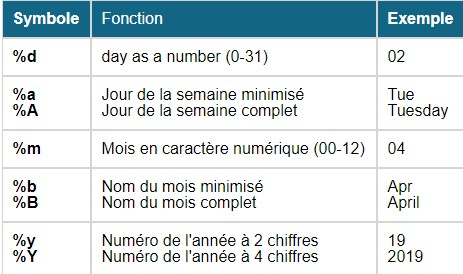

# Premiers pas avec les données PMSI importées avec pmeasyr

## Import des données MCO

La première étape de choisir un répertoire de travail et d'enregistrer vos fichiers de remontées dans ce répertoire. Nosu prendrons ici les recommandations de Guillaume : `'~/Documents/data/mco` .

Les noms des fichiers en sortie de GENRSA sont de la forme :

- finess.annee.mois.date_et_heure_de_creation.in.zip
- finess.annee.mois.date_et_heure_de_creation.out.zip

Ensuite on dézippe l'archive avec la fonction adzip :


```r
pmeasyr::adezip(finess = 750712184, 
                annee = 2021, 
                mois = 8, 
                path = 'C:/Users/3056269/Documents/data/mco', 
                liste = c("rss"), 
                type = "in")
```


Import des rsa :


```r
pmeasyr::irum(finess = 750712184, 
     annee = 2021, 
     mois = 8, 
     path = 'C:/Users/3056269/Documents/data/mco', 
     typi = 4, 
     tolower_names = TRUE ) -> rum21
```

L'import a créé plusiseurs dataframe qui sont rangé dans l'objet rsa21 qui est une liste :

```r
typeof(rum21)
names(rum21)
```

## Premières analyses

Dans cette première partie nous allons tester différents calcul sur les RSA avec le formalisme de dplyr. Commençons par charger le package de façon à ne pas avoir à repéter le préfix `dplyr::` :


```r
library(dplyr)
```

Sélectionner les rum dont le diagnostic est I10 :

```r
rum21$rum %>% filter(dp == "I10")
```

Sélectionner les rum dont le diagnostic est I10 et changer le format de la date pour avoir le mois de sortie.

```r
rum21$rum %>% filter(dp == "I10") %>%
  mutate(moissor = format(d8soue,"%m")  )
```

<!-- -->


On peut donc changer le format d'une date en R avec la fonction `format`. Ci dessus les principaux type de format utilisés.

Sélectionner les rum dont le diagnostic est I10 et compter le nombre de résumé par mois, fonction `n()` permet de compte le nombre de ligne dans le tableau de données, ici groupé par mois :

```r
rum21$rum %>% filter(dp == "I10") %>%
  mutate(moissor = format(d8soue,"%m")  ) %>%
  group_by(moissor) %>%
  summarise(nb = n())
```


Créer une table qui permette d'avoir la date d'entrée et de sortie du séjour :

```r
dates_sejours <- rum21$rum %>% 
                      group_by(nas) %>%
                      summarise(dtentr = min(d8eeue),
                                dtsor = max(d8soue)) %>%
                      ungroup()
dates_sejours
```


Réaliser la jointure entre les RUM et les dates d'entrée/sortie du séjours pour faire un calcul du nombre de RUM par mois de sortie du séjour :


```r
rum21$rum %>% dplyr::filter(dp == "I10") %>%
  left_join(.,dates_sejours) %>%
  mutate(moissor = format(dtsor,"%m")  ) %>%
  group_by(moissor) %>%
  summarise(nb = n())
```

Par défaut, la jointure est réalisée sur les colonnes qui sont présentes dans les 2 dataframes :

Ne compter que les séjours et non les RUM :

```r
rum21$rum %>% dplyr::filter(dp == "I10") %>%
  left_join(.,dates_sejours) %>%
  mutate(moissor = format(dtsor,"%m")  ) %>%
  group_by(moissor) %>%
  summarise(nb = length(unique(nas)))
```

Rechercher le diagnostic dans l'ensemble des diagnostics :
1) Rechercher le diagnostic  dans les diagnostics associés

```r
rum21$das %>% dplyr::filter(das == "I10") -> das_i10
```
2) utiliser ce résultat pour compléter la recherche 

```r
rum21$rum %>% dplyr::filter(dp == "I10" | nas %in% das_i10$nas ) %>%
  left_join(.,dates_sejours) %>%
  mutate(moissor = format(dtsor,"%m")  ) %>%
  group_by(moissor) %>%
  summarise(nb = length(unique(nas)))
```


Faire la même recherche pour les patients qui résident à Paris :

```r
rum21$rum %>% dplyr::filter(dp == "I10" | nas %in% das_i10$nas, 
                            substr(cdresi,1,2) == "75" ) %>%
  left_join(.,dates_sejours) %>%
  mutate(moissor = format(dtsor,"%m")  ) %>%
  group_by(moissor) %>%
  summarise(nb = length(unique(nas)))
```
